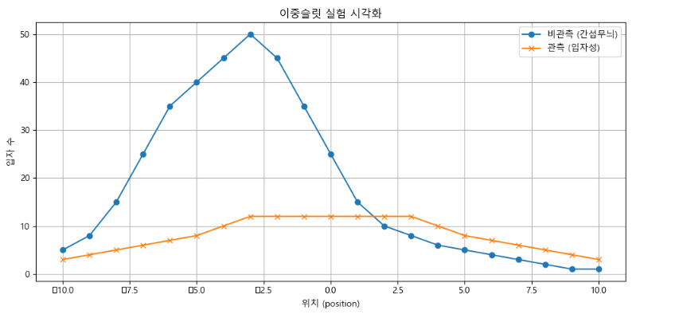
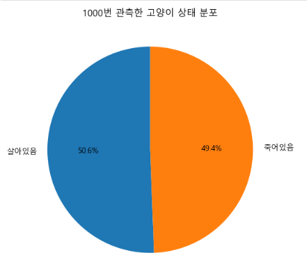

# 🚪 explaining-the-impossible  
불가능한 설명을 설명한다 – 철학적 데이터 분석 포트폴리오

이 프로젝트는 양자역학의 철학적 질문을 바탕으로,  
관측되지 않은 상태나 변수도 실제로 존재할 수 있다는 관점에서  
데이터 분석을 시도한 실험 기반 포트폴리오입니다.

특히, 아인슈타인이 주장한 **“관측과 무관하게 현실은 존재한다”는 실재론적 입장**에 대해,  
이중슬릿 실험과 슈뢰딩거의 고양이 실험을 통해  
**관측이 현실을 결정할 수 있다는 양자역학적 해석의 타당성**을 시각화와 데이터로 반박하고자 했습니다.

---

## 📘 프로젝트 개요

- **주제**: 관측 이전의 상태는 실재하는가?  
- **포인트**: 관측되지 않은 데이터 속 의미와 변수를 해석하는 통찰적 실험  
- **접근**: 양자역학의 중첩, 불확정성, 말려 있는 차원을 데이터 분석적 시선으로 적용

---

## 📊 분석 내용

1. **이중슬릿 실험 시뮬레이션**  
   - 관측 유무에 따른 입자 분포 변화를 그래프로 시각화  
   - 간섭무늬 vs 입자성 분포를 비교 분석

2. **슈뢰딩거의 고양이 실험 구현**  
   - 단일 관측: 클래스로 중첩 상태 → 관측 순간 확정  
   - 다중 관측: 1000번 반복해 통계적 분포를 파이차트로 시각화

---

## 🧠 철학적 관점

> 관측되지 않았다고 해서 존재하지 않는 것은 아니다.  
> 우리는 어떤 데이터를 보고, 어떤 데이터는 보지 못하는가?

- 아인슈타인의 실재론 vs 양자역학 해석  
- 끈 이론은 우리가 감지하지 못하는 **말려 있는 차원(compactified dimensions)**의 존재를 전제로 한다.  
  이는 관측되지 않아도 물리적으로 존재할 수 있다는 가능성을 과학적으로 제시하며,  
  아인슈타인의 "관측과 무관하게 현실은 존재한다"는 실재론을 보완하거나 반박하는 데 활용된다.  
- 데이터 분석에서 드러나지 않은 흐름은 어떻게 포착되는가?

---

## 📁 폴더 구조

| 폴더/파일       | 설명                            |
|------------------|----------------------------------|
| `/notebooks`     | 실험 코드 (.ipynb)               |
| `/visuals`       | 시각화 이미지 (png, jpg 등)      |
| `/docs`          | 발표자료 또는 PDF 문서           |
| `README.md`      | 프로젝트 전체 설명 파일          |

---

## 🧪 주요 분석 노트북

- [이중슬릿 실험 시뮬레이션 보기](./notebooks/quantum_observation_effect.ipynb)  
- [슈뢰딩거의 고양이 시뮬레이션 보기](./notebooks/schrodinger_cat.ipynb)

---

## 🔍 시각화 결과

### 🎯 이중슬릿 실험 결과

> 이 시각화는 관측 유무에 따라 입자 분포가 어떻게 달라지는지를 보여줍니다.  
> 관측하지 않으면 입자는 파동처럼 간섭무늬를 만들고,  
> 관측하면 입자처럼 행동하여 균일하게 퍼집니다.

> **“관측”이라는 행위가 현실의 결과를 바꾼다는 역설적 메시지**는  
> 우리가 보는 데이터가 본질이 아니라, **관측의 산물일 수 있음**을 시사합니다.

---

### 🐱 슈뢰딩거의 고양이 실험 결과

> 이 시각화는 1000번의 관측 결과를 통계적으로 보여줍니다.  
> 하지만 이 그래프는 단지 **우리가 들춰본 현실의 일부**일 뿐,  
> 고양이가 상자 안에 있을 때의 중첩된 상태는 여전히 **보이지 않는 실재**로 남습니다.

> 우리는 결과를 해석할 수 있지만, **그 이전의 상태는 언제나 해석 바깥에 존재**합니다.  
> 관측되지 않은 것은 존재하지 않는 걸까, 혹은 아직 드러나지 않았을 뿐일까?

---

## 💬 실행 환경

- Python 3.10+
- numpy  
- pandas  
- matplotlib  
- (한글 그래프 표시를 위해 `Malgun Gothic` 폰트 설정 필요)

---

## 📢 사용 목적

- 철학을 데이터 분석으로 해석하는 시도  
- 포트폴리오/연구/교육 자료로 자유롭게 활용 가능

---

## 📧 문의

> 이 프로젝트는 개인 포트폴리오용으로 제작되었습니다.  
> 문의사항은 GitHub Issue 또는 이메일로 전달 부탁드립니다.
